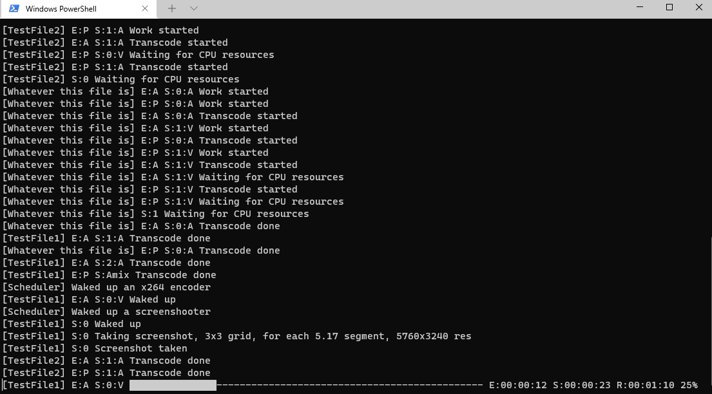
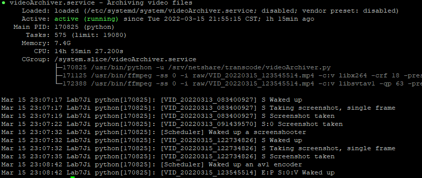
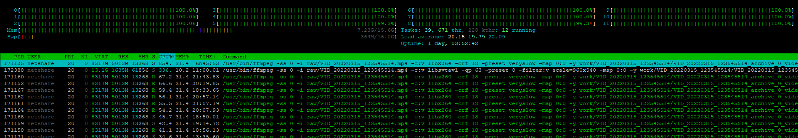

# videoArchiver.py
### A multithreading video archiving script, generating both archive-level and preview-level AV1 video footages and N by N montage snapshots with ease, so you can easily store the big archive guy to the cold storage and keep the tiny preview footage and snapshots by hand to save your precious disk space. 
### With stream level multithreading and interrupt-proof recovery support, using the videoArchiver.service file coming with it, you can easily set it up as a daemon, and let it run forever.
### **This project is still under development and you should not use it in production environment**
### Step to use it
1. Git clone this repository, or copy paste the content of videoArchiver.py
2. python videoArchiver.py
3. Multiple folders will be created under the folder you execute the last command, this includes raw, archive, preview, screenshot, work, log.
4. Drop the videos you want to archive in raw/
5. Take a coffee, and let your PC suffer

### Feature list
- [X] **Video archiving**. The archive footage process goes as the following:
    - Any video stream will be encoded with "-c:v libx264 -crf 18 -preset veryslow" seperately to achive visually lossless quality. During the transcode, after the output length is greater than 10 seconds, if the output stream size is greater than 0.9 * raw stream size * output length / raw stream length, then the transcoded will be terminated, and the raw stream will be used instead.
    - Any audio stream will be encoded with "-c:a libopus -b:a 128000" seperately to achive audibly lossless quality. During the transcode, after the output length is greater than 10 seconds, if the output stream size is greater than 0.9 * raw stream size * output length / raw stream length, then the transcoded will be terminated, and the raw stream will be used instead.
    - Any other stream will be passed through
    - Any metadata will be passed through, this, however, does not contain some container-specific metadatas, such as rotation metadata in MP4 container
    - All output streams and the raw streams will be muxed into a new MKV container, the streams will still be of the same order, with their and the old container's metadata intact.
- [X] **Video previewing**. The preview footage process goes as the following:
    - Any video stream will be encoded with "-c:v libsvtav1 -crf 63 -preset 8" seperately to achive best visual quality / size ratio under the fastest speed. Additionally, any video stream with width/height greater than 1000 will be rescaled (1/2)^n so it's less than 1000
    - All audio streams will be amixed info a single audio stream, with "-c:a libopus -b:a 10000" to achive the best audibly quality / size ratio. Amixing will not happen if there's only one audio stream
    - Any other stream will be dropped
    - Any metadata will be dropped
    - All output video streams and audio streams will be muxed into a new MKV container, the video streams will be of their old order, with the one possible audio stream coming at the bottom
- [X] **Montage screenshot**. The montage screenshot process goes as the following:
    - For all video streams, screenshot will be taken seperately, meaning if there are multiple video streams, a sub folder will be created to hold all stream-corresponding screenshots, instead of one screenshot file directly put in the screenshot folder
    - For a video stream, the N in n by n montage is decided by the its duration, it's calculated as follows:
        - N = log(video duration / 2 + 1),  N ∈ [1, 10], N is integer
    - For a 1 by 1 montage (rather call it a single frame screenshot), the frame in the middle will be extracted as screenshot
    - For a N by N montage larget than 2 by 2, tiles=N^2 frames will be extracted, with time delta = video duration / tiles
    - When tiles > video duration, a select filter and a tile filter will be used, the video is fully decoded so wanted frames can be used to create a montage.
    - When tiles <= video duration, tiles times seekings will happen, each directly seek at the time the wanted frame is shown, this way the video is decoded tile times, but saves resource used for decoding.
- [X] **Multithreading**. Any encoding, muxing, screenshooting and scheduling happenes in their dedicated threads. It's basicly files X streams X 3 level multithreading
    - Different from av1an, a stream itself is not multithreaded, this is to prevent space waste on unneccessary I-frames
- [X] **Database (not fully)** All videos and their information will be stored in database, so if you interrupt the videoArchiver.py, the next time you start it, it still remembers the videos it have scanned before. 
    - This currently is achived via pickle, and only remember a certain video until all the archive/preview/screenshot work is done to save memory/disk usage.
    - A rewrite of the database routine is under going, sqlite might be a replacement
- [X] **Interrupt transcode recovery**. For any interrupted video/audio transode, videoArchiver.py will try to recover usable frames. The actual recovery process is different depending on the stream type
    - For audio stream, all full frames will be recovered
    - For video stream, all full GOPs will be recovered. Meaning any frame after the last I-frame will be dropped. Multiple I-frames could be saved this way if interrupts really happen alot
- [X] **Progress Bar** For any transcode, a handy progress bar will be shown, showing E(Encoded) S(Spent time) R(Remaing time estimated). The progress bar will be updated constantly to show the recent updated one, and will always stay in one line, preventing console junking
    - If used without a real tty, either you redirect stdout to file/null, or use it as a daemon managed by systemd or other stuff, the progress bar is not even calculated, you could save some CPU resources from this
    - However, even if you use videoArchiver.py by directly running it, and has the progress bar shown, the perfomance penalty is basically nothing. The calculation process is already heavily optimised to save your precious CPU resource for transcoding.
### Todo List
- [ ] **Custom codec settings**
- [ ] **Configuration support** 
    - videoArchiver.py is already written with this in mind, it could be easy to really implement this

## Windows

## Linux

## Linux load

## Demo montage screenshot
